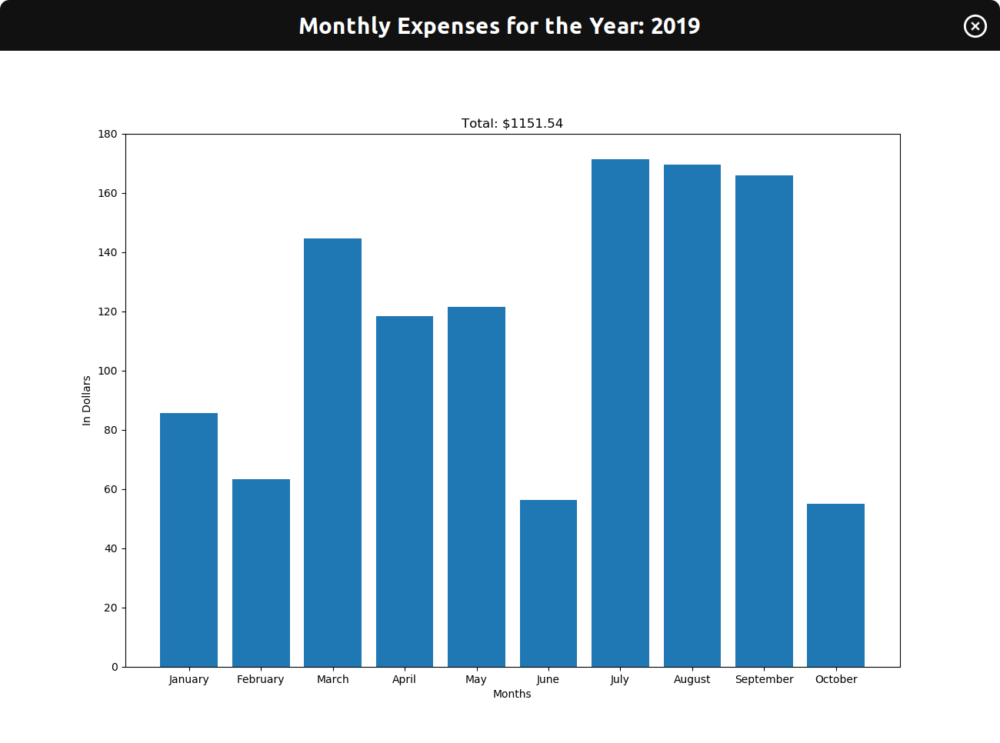

# transactionsAnalyzer.py
This program reads a CSV file of transaction records.

Next, the user has two options in the main window: 
1. Display all transactions in sorted order (by date, name, or cost).
2. Display monthly spendings for a given year.

Within the 1st option, the user could select a sort option that displays a listbox, which has the ability to filter out any name if the user pleases.

Within the 2nd option, the user can view a monthly graph for a given year. Available options include showing all transactions, showing filtered transactions, or showing specific transactions.

## Origin of the Project
Back when I was working at Trader Joe's—buying the premade lunches and groceries there—I wondered how much I was spending.

Unfortunately, my credit card account doesn't allow the ability to analyze my transactions. (At least to my knowledge.) At best, I could scroll through the list of transactions and view each one individually. Nothing fancy.

That wasn't good enough for me; I wanted to organize my transactions in a way that I could view my spendings holistically.
For example, I wanted to see how much I've spend at Trader Joe's per month. Or because my parents used my credit card for the water and electric online bills, I wanted to exclude those transactions when viewing my personal spendings; don't worry, they reimbursed me.

Thus, this project is the result of my curiosity! 

P.S. Turns out I've spent a total of 1638.86 USD at Trader Joe's within a year range with my credit card. That averages to $137 per month. Not too shabby!

## Code Snippets (Shortened for Concision) + Images

#### Screenshot of Input File


#### Input File Prompt Window (Pops up after opening program)


#### Main Window
```python
class MainWindow(tk.Tk):
    def __init__(self):
        super().__init__()
        
        # Class variable
        self._filename = ""
        self._transactionsList = []        
        
        # Variables for columns within csv file of Capital One's Credit Card
        self._transactionDate = "Transaction Date"
        self._transactionDateFormat = "%Y-%m-%d"
        self._transactionName = "Description"
        self._transactionCost = "Debit"
        
        # Functions
        self.createButtons()
        self.selectInputFile()
        self.readDataIntoTransactionsList()        
        
    def createButtons(self):
        tk.Button(self, text = "Display all transactions", command= lambda: TransactionOptions(self)).grid()
        tk.Button(self, text = "Display monthly spendings for a given year", command= lambda: MonthlySpendings(self)).grid()      
        
    def selectInputFile(self):
        while ".csv" not in self._filename.lower():
            self._filename = tk.filedialog.askopenfilename(initialdir= getcwd()) 

            # If user doesn't choose a file, exit the program
            if len(self._filename) == 0:
                raise SystemExit    
            
            if ".csv" not in self._filename.lower():
                tk.messagebox.showerror("Error", "Select a '.csv' file extension", parent=self)             
        
    def readDataIntoTransactionsList(self):
        with open(self._filename) as filehandler:
            data = csv.DictReader(filehandler)
            
            for record in data:
                # Skip any credit card payments
                if record[self._transactionCost] is "":
                    continue        
                self._transactionsList.append(record)                
            
def main():
    app = MainWindow()
    app.mainloop()
```


#### Display All Transactions Options
```python
class TransactionOptions(tk.Toplevel):
    def __init__(self, master):
        super().__init__(master)
        self.transient(master)  
        
        tk.Button(self, text= "Sorted by date", command= lambda: self.transactionListByDate(master)).grid()
        tk.Button(self, text= "Sorted by name", command= lambda: self.transactionsListByName(master)).grid()
        tk.Button(self, text= "Sorted by cost", command= lambda: self.transactionsListByCost(master)).grid()   
        
    def transactionListByDate(self, master):
        ''' Uses the master's transactions list, which is sorted by date by default '''
        AllTransactions(master, master._transactionsList)
        self.destroy()
        
    def transactionsListByName(self, master):
        ''' Resort the master's transactions list into a new list by name'''
        transactionsList = sorted(master._transactionsList, key= lambda record: record[master._transactionName])
        sortedByNameObj = AllTransactions(master, transactionsList)
        self.destroy()
        
    def transactionsListByCost(self, master):
        ''' Resort the master's transactions list into a new list by cost'''
        transactionsList = sorted(master._transactionsList, key= lambda record: float(record[master._transactionCost].strip()), reverse=True)
        sortedByCostObj = AllTransactions(master, transactionsList)
        self.destroy()
```


#### Monthly Spendings Window
```python
class MonthlySpendings(tk.Toplevel):
    def __init__(self, master):
        super().__init__(master)
        self.transient(master)    
        
        # Class variables
        self._functionsList = [self.allTransactions, self.filteredTransactionsPrompt, self.specificTransactionPrompt]
        # Create dictionary to track spendings for each month
        self._monthsDict = {'January': 0.0, 'February': 0.0, 'March': 0.0, 'April': 0.0, 'May': 0.0, 'June': 0.0, 'July': 0.0, 
                      'August': 0.0, 'September': 0.0, 'October': 0.0, 'November': 0.0, 'December': 0.0}  
        # Sort 'transactionsList' in ascending order (so January is first instead of latest month)
        self._transactionsList = sorted(master._transactionsList, \
                                  key=lambda record: datetime.strptime(record[master._transactionDate], master._transactionDateFormat))     
            
        # User prompt for transactions options
        inputYear = tk.IntVar()
        tk.Label(self, text = "Enter a year: ").grid()
        entryWidget = tk.Entry(self, textvariable=inputYear)
        entryWidget.grid()

        buttonOption = tk.IntVar()
        allTransactionsButton = tk.Radiobutton(self, text="Show all transactions", variable=buttonOption, value=0).grid()
        filteredTransactionButton = tk.Radiobutton(self, text="Show filtered transactions", variable=buttonOption, value=1).grid()
        specificTransactionsButton = tk.Radiobutton(self, text="Show specific transactions", variable=buttonOption, value=2).grid()
        confirmButton = tk.Button(self, text="Continue", command=lambda: \
                                  self.callFunction(master, self._monthsDict, self._transactionsList, inputYear.get(), buttonOption.get())).grid()
        
        buttonOption.set(0)
    
    def callFunction(self, master, monthsDict, transactionsList, inputYear, buttonOption): 
        ''' Call one of the three functions '''
        self._functionsList[buttonOption](master, monthsDict, transactionsList, inputYear)
```


#### Monthly Listbox + Graph
```python
class MonthGraph(tk.Toplevel):
    def __init__(self, master, monthsDict, inputYear, listboxObj):
        super().__init__(master)    

        self.title("Monthly Expenses for the Year: " + str(inputYear))
        plt.title(str("Total: $" + "{0:.2f}".format(sum(monthsDict.values()))))

        plt.bar([month for month,cost in monthsDict.items() if cost != 0], \
                [cost for cost in monthsDict.values() if cost != 0], align="center")
        
        plt.xlabel("Months")
        plt.ylabel("In Dollars")
        
        canvas = FigureCanvasTkAgg(fig, self)
        canvas.get_tk_widget().pack(side="top", fill="both", expand=True)
        canvas.draw()      
```



