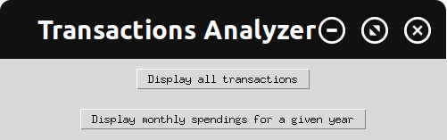

## transactionsAnalyzer.py
This program reads a CSV file of transaction records, inputting them into a list data structure.

Next, the user has two options in the main window: 
1. Displaying all transactions in sorted order (by date, name, or cost).
2. Display monthly spendings for a given year

Within the 1st option, the user could select a sort option that displays a listbox, which has the ability to filter out any name if the user pleases.

Within the 2nd option, the user can view a monthly graph for a given year. Options include the ability to show all transactions, filtered transactions, and specific transactions.

## Origin of the Project
While working at Trader Joe's, I wondered how much I was spending there.

Unfortunately, my credit card account doesn't allow the ability to analyze my transactions. (At least to my knowledge.) At best, I could scroll through the list of transactions and view each one individually. Nothing fancy.

That wasn't good enough for me; I wanted to organize my transactions in a way that I could view my spendings holistically.
For example, I wanted to see how much I've spend at Trader Joe's per month. Or because my parents used my credit card for the water and electric online bills, I wanted to exclude those transactions when viewing my personal spendings; don't worry, they reimbursed me.

Thus, this project is the result of my curiosity! 

P.S. Turns out I've spent a total of 1638.86 USD at Trader Joe's within a year range with my credit card. That averages to $137 per month. Not too shabby!

## Images





## Welcome to GitHub Pages

You can use the [editor on GitHub](https://github.com/Jokuyen/transactionsAnalyzer/edit/master/README.md) to maintain and preview the content for your website in Markdown files.

Whenever you commit to this repository, GitHub Pages will run [Jekyll](https://jekyllrb.com/) to rebuild the pages in your site, from the content in your Markdown files.

### Markdown

Markdown is a lightweight and easy-to-use syntax for styling your writing. It includes conventions for

```markdown
Syntax highlighted code block

# Header 1
## Header 2
### Header 3

- Bulleted
- List

1. Numbered
2. List

**Bold** and _Italic_ and `Code` text

[Link](url) and 
```

For more details see [GitHub Flavored Markdown](https://guides.github.com/features/mastering-markdown/).

### Jekyll Themes

Your Pages site will use the layout and styles from the Jekyll theme you have selected in your [repository settings](https://github.com/Jokuyen/transactionsAnalyzer/settings). The name of this theme is saved in the Jekyll `_config.yml` configuration file.

### Support or Contact

Having trouble with Pages? Check out our [documentation](https://help.github.com/categories/github-pages-basics/) or [contact support](https://github.com/contact) and we’ll help you sort it out.
